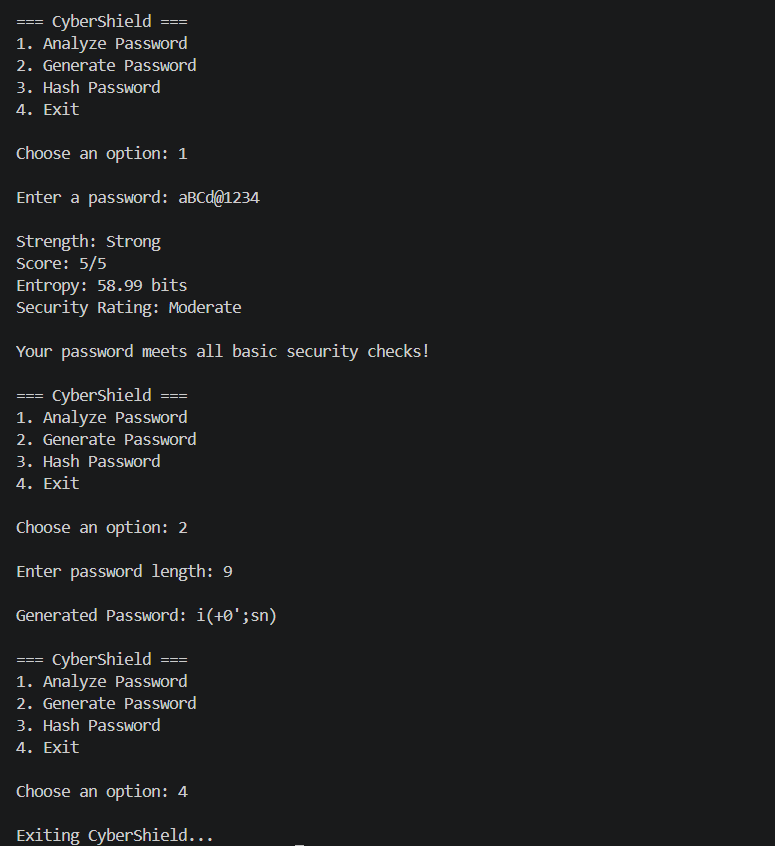

# 🛡️ CyberShield
A Flask-based cybersecurity toolkit for password analysis, secure password generation, entropy estimation, security ratings, and SHA-256 hashing.


## 🌐 Live Demo

[🚀 Open CyberShield](https://cybershield-gxjj.onrender.com)

## 📸 Preview




## ✨ Features

- 🔍 Password strength analysis
- 🚨 Common password detection
- 🔐 Strong password generation
- #️⃣ SHA-256 hashing
- 💡 Security recommendations
- 🖥️ Interactive web dashboard

## 🛠️ Technologies Used

- Python
- Regular Expressions
- hashlib
- Git & GitHub

## 📂 Project Structure

```text
CyberShield/
│
├── app.py
├── password_analyzer.py
├── password_generator.py
├── hash_generator.py
├── requirements.txt
├── README.md
└── .gitignore
